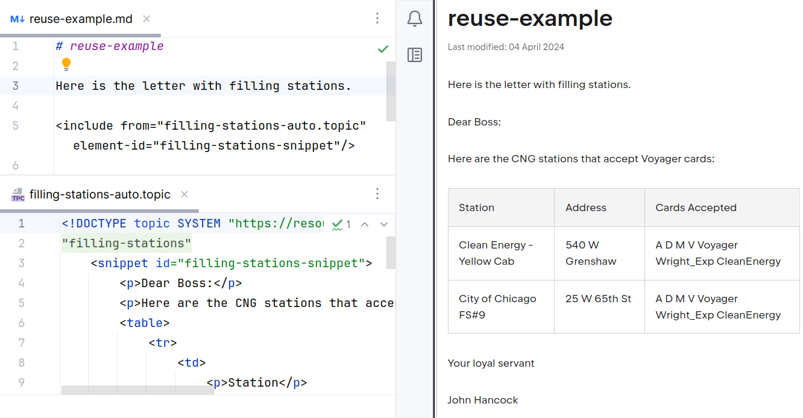

= Kotlin -- лучший язык для{nbsp}DocOps
:!imagesdir:
:source-highlighter: rouge
:rouge-css: style
:revealjsdir: reveal.js
:revealjs_customtheme: white-course.css
:revealjs_slideNumber:
:revealjs_history:
:revealjs_progress:
:revealjs_mouseWheel: true
:revealjs_center: false
:revealjs_transition: none
:revealjs_width: 1600
:revealjs_height: 900
:icons: font
:figure-caption!:
:example-caption!:
:table-caption!:

[.title-footer]
[cols="260,1100,320"]
|===
a|
[.title-photo]
image::images/nmp1.jpg[]
a|
[.fio]
Николай Поташников

Руководитель проектов, IT-архитектор +
КУРС-ИТ
.2+>.>a|
{nbsp}
[.title-hb]
image::images/tw-1-1v.png[]
2+a|
[.contact]
icon:envelope[] consulting@yandex.ru {nbsp}{nbsp} icon:telegram[] @nmpotashnikoff
|===

[[trebovaniya]]
== Требования к программному обеспечению

include::versions.adoc[]

* Операционная система: {os-version}
* {intellij-version}
* Java: {java-version}
* Kotlin: {kotlin-version}

(указаны версии, которые будут использоваться для показа)

[TIP]
[.indent-before]
====
* https://storage.yandexcloud.net/fiddle-de-dee-public/twd-1/tw1.ova[Виртуальная машина] (пароль пользователя -- «1»)
+
Короткая ссылка: https://clck.ru/39qbaD
* https://github.com/fiddlededee/twd1-kotlin[Примеры]
+
Короткая ссылка: https://clck.ru/39qbra
====

== Почему Kotlin

[%step]
* Умеет работать как скриптовый язык с декларативным синтаксисом для зависимостей
* Статически типизированный язык
* Относится к экосистеме Java
* Обеспечивает синтаксис, который мы привыкли использовать в шаблонизаторах
* Поддерживает компиляцию

== Перечень примеров

[%step]
* Hello world -- вывести строку можно по-разному
* Preprocess md -- создаем препроцессор для ссылки на запросы на изменения (aka Ишуи, Тикеты, Задачи, Эпики)
* Convert -- конвертируем md в html
* Read json -- генерируем документацию на основе входных артефактов
* Postprocess -- проверяем орфографию и много чего другого

== Hello world

[%step]
* Запуск kts-файла: shebang, правила именования -- `[name].main.kts`
* DSL-конструкции
** `apply` -- функция области видимости
** Вынос ламбды за скобки
** Функции расширения
** Перегрузка операторов
* Последовательность трансформаций

[%step]
[.indent-before]
[TIP]
====
Важна ли читаемость кода в DocOps?
====

== Препроцессинг

[%step]
* `+++__FILE__+++` (работает только при запуске как скрипта)
* Замена в регулярных выражениях через ламбду
* Интерполяция в Kotlin

[%step]
[.indent-before]
[TIP]
====
Препроцессинг -- норм?
====

== Конвертация

[%step]
* Декларативный синтаксис для зависимостей
* Параметры командной строки

[%step]
[.indent-before]
[TIP]
====
Паттерн документирования «Issue в JIRA» -- норм?
====

[.no-footer]
== Определение текущих версий для мастер-класса

[source, kotlin]
----
include::build.main.kts[tag=versions]
----

[.no-footer]
== Определение текущих версий для мастер-класса

[.focus-lines]
[source, kotlin, highlight="4..7"]
----
include::build.main.kts[tag=versions]
----

[.indent-before]
[source, kotlin, highlight="4..6"]
----
include::build.main.kts[tag=verclirule]
----

[.no-footer]
== Определение текущих версий для мастер-класса

[.focus-lines]
[source, kotlin, highlight="4..7"]
----
include::build.main.kts[tag=versions]
----

[.focus-lines]
[.indent-before]
[source, kotlin, highlight="4..6"]
----
include::build.main.kts[tag=verclirule]
----

[.no-footer]
== Генерация документации -- исходный JSON

[source, json]
----
include::080-builder/filling-stations.json[]
----

[.no-footer]
== Генерация документации -- конструктор (builder)

[source, json]
----
include::080-builder/builder.main.kts[tag=snippet]
----

[.no-footer]
== Генерация документации -- конструктор (builder)

== Переиспользование внешних артефактов в документации

[%step]
[.indent-before]
* Data-классы для десериализации
* Jackson для работы с JSON-файлами (XML, YAML)
* Функции работы с массивом для генерации текста
* `"""` для многострочного текста
* Infix-функции (DSL-конструкция)
* Null безопасность
* Рефакторинг

[%step]
[.indent-before]
[TIP]
====
Какие артефакты кодирования мы можем использовать в документации?
====

[.in-place-step]
== Как сделан нижний колонтитул в данной презентации

[%step]
[source,kotlin,highlight="2"]
[.focus-lines]
----
include::build.main.kts[tag=conversion]
----

[%step]
[source,kotlin,highlight="4..5"]
[.focus-lines]
----
include::build.main.kts[tag=conversion]
----

[%step]
[source,kotlin,highlight="7..8"]
[.focus-lines]
----
include::build.main.kts[tag=conversion]
----

== Постпроцессинг

[%step]
* JSoup -- работа с файлами `HTML`
* LanguageTools -- одна из лучших библиотек для проверки орфографии

[%step]
[.indent-before]
[TIP]
====
Что удобно делать на этапе постпроцессинга?
====

== Возможности использования Kotlin в процессах CI/CD

[%step]
* Как скрипт
* Как скомпилированный скрипт (отдельный проект https://github.com/kscripting/kscript[kscript])
* Как обычный Java/Kotlin-(под)проект (Gradle/Maven)
* Как часть Gradle-скрипта сборки

== Выводы

[.no-border]
[cols="5,^1"]
|===
a|
[%step]
.Плюсы
* Удобен для работы с документацией
* Обладает широкой экосистемой
* Отлично поддерживается IDE
* Удобно встраивается в процессы CI/CD

[%step]
[.indent-before]
.Минусы
* Требовательнее `bash` и даже `Python` для CI/CD
* Более медленный, если запускать как скрипт
a|
[%step]
--
[discrete]
==== Вопросы?

[.with-title]
.https://t.me/nmpotashnikoff[@nmpotashnikoff]

[.with-title]
.https://t.me/twdays_channel/19[@twdays_channel]

--
|===

